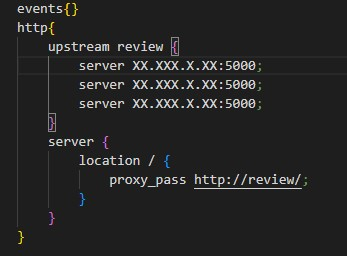
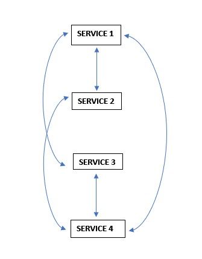

# consolegame
SFIA 2 Practical Project - Console & Game Generator
# SFIA-2 QA Academy Practical Project - Console and Game Generator

## Contents
* [Objectives](#objectives)
* [Installation Process](#installation-process)
* [My approach & Design Phase](#my-approachmethodologies-used-&-design-phase)
* [Design](#design-phase)
* [Risk Assesment](#risk-assessment)
* [Future Improvements](#future-improvements)
* [Final Thoughts](#final-thoughts)
* [Honorable Mentions/Accrediations](#honorable-mentionsaccreditations) 

### Helpful Resources
* Kanban board: 
 
 

## Objectives
In this project, I was tasked to create 4 services which work together to produce an outcome on a webpage. For successful completion of this project, I implemented the MoSCoW approach. The following list is what must be included in the project:
* Create a KanBan board with full expansion on tasks needed to complete the project. I can provide developmental progress/issues I ran into on this KanBan board as well.
* Have an application fully integrated using the Feature-Branch model into a Version Control System (I will be using GitHub), which will be built through a CI server (Jenkins) and deployed into a cloud-based virtual machine (GCP in my case).
* If changes are made to the code base, webhooks should be used so that Jenkins recreates and deploys the changed application.
* The project must follow the service-oriented architecture that has been asked for (outlined below).
* The project must be deployed using containerisation (DockerHub) and an orchestration tool.
* I must use a Ansible Playbook to provision the environment my application needs to run.
* The project must make use of a reverse proxy to make my application accessible to the user (nginx).
* Lastly, I have to present my work and discuss my ideas and implementation in a video as well as all the tools I have used and how QA Academy has helped me to use these tools.

 
 
 

## Installation Process
Installation process:
1.	Create 4 VMs, naming them ‘ansiblemanager’, ‘manager’, ‘worker’, and ‘nginx’.
 
2.	Proceed to go into all VMs and type ‘sudo apt update’.
 
3.	Generate an SSH key on the ‘ansiblemanager’ and retrieve this by typing the command ‘cat .ssh/id_rsa.pub (if you run into an issue where you VMs are not running, cd into ‘.ssh’ and delete ‘known_hosts’ but doing ‘rm known_hosts’
 
4.	After you have retrieved this SSH key, go onto GCP and put them into the ‘manager’ and ‘worker’ Virtual Machine under the ‘Security and access’ section.
 
5.	After this, you can simply clone or fork the repository onto the ansible machine. If you would like to make use of the Jenkins Web-Hook, fork the repository, if you want to simply use the application or make edits to it at the bare minimum, just clone the repository to the ‘ansible manager’ Virtual Machine.
 
6.	To connect the ‘ansiblemanger’, ‘manager’ and ‘worker’ VMs together, go into ‘ansiblemanager’ and type the following code in a bash terminal:
*	docker swarm init
*	docker swarm join-token worker
*	docker swarm join-token manager
*	Then place the code produced into the ‘manager’ and ‘worker’ VMs accordingly.

 
7.	After you successfully retrieve the repository through your chosen method, enter the ‘manager’ Virtual Machine and create a ‘curl.sh’ file and type in the following code:
*	sudo apt update
*	sudo apt install -y curl jq
*	version=$(curl -s https://api.github.com/repos/docker/compose/releases/latest | jq -r '.tag_name')
*	sudo curl -L "https://github.com/docker/compose/releases/download/${version}/docker-compose-$(uname -s)-$(uname -m)" -o /usr/local/bin/docker-compose
*	sudo chmod +x /usr/local/bin/docker-compose
*	To check you have installed docker-compose successfully, type ‘docker-compose –version’
 
 
8. After you have done this, you need to set up nginx. This is done by going to the nginx VM, and typing ‘nano /etc/nginx/nginx.conf’ in the console. Within this file, put the following code with the correct indentations (fill the ‘X’ with your private IP address with the ‘ansiblemanager’, ‘manager’ and ‘worker’ in that order.:

 
9. Lastly, you have to go to the ‘ansiblemanager’ and type ‘ansible-playbook -I inventory.yaml playbook.yaml’. This will run your application.

 
 
 

## My Approach/Methodologies Used & Design Phase
Going forward, the following section is the ‘should have’ in MoSCoW. These are not necessary but improve the user experience as a whole greatly:
* The application should have a minimum of 5 consoles and 5 games for the generator to produce values for. This is for the user to have a greater variety of options regarding the game and consoles they are provided. Originally, my idea was to stick with 3 consoles and 3 games but I increased this to display a better understanding of the task at hand and mainly practice for future placements.

Leading on to the next section, I have listed what could have been implemented for a better user experience:
* I could have added the option for the user to type in a console of their choice, which in turn will be followed by a random game. This gives the user the ability to choose a specific console if they don’t own all of the ones listed above.
* I could have also linked my application to a website with a large number of games, creating a larger variety of choices as opposed to the 25 options that the current application provides.

Lastly, my application will not have:
* The option to type in a console or a game and get a randomly generated variable according to what they have typed. For example, if they typed in a game, they will be provided a console and vice versa. This is something that I would like to implement in the future as it would improve the user experience greatly.
* The application will not have 100 different combinations (5 consoles and 20 games) as in the timeframe I had, it would have consumed a lot of time to produce such an application as the testing would have to follow and I cannot work Jenkins without covering every possibly option.

# Use of AGILE methodology:

 
I intentionally used the AGILE methodology as it was critical for me to adapt to issues with my application. The first issue I ran into was with my original design of the application which was going to be a username generator, one service would generate letters and the other numbers and based on the alphabetical order of the word, it would concatenate it in a certain way. I decided to change my application to a console and game generator as I could provided a exhaustive list of outcomes whereas in my other idea (username generator), there were infinite outcomes.
 
The idea I decided to use allowed me to achieve the completion of my application in a timely manner, in line with my deadlines.
 
 
My first sprint was designing my application with the use of all of the services I provided in the ‘Requirements of Project’ section. This was in order to ensure I have touched upon all aspects which are required to successfully complete my project with the highest possible marks I could achieve. Alongside this, I create da risk assessment outlining possible issues I could run into and how I could avoid them as best as possible and what I could do if these risks came into fruition.
 
 
My second sprint, I decided to go ahead and type up the code, implementing the logic correctly and troubleshooting any errors that may have arisen. I made a brief template of my service 1 and home.html so once I have coded service 2, I can check if it works as designed. After typing a brief template of the service 1, I went onto service 2, coded that and checked if it worked. This service worked perfectly and ran without issues. The same was true for service 3, as these two services were very similar in terms of logic and I just needed to change a few things. When it came to service 4, I ran into an issue where the console and game were being produced but only the ‘else’ statement was being produced on the website. This was due to a space being placed into the concatenation string in service 1. This meant that in service 4, it was not reading the 2 outputs from service 2 and 3 due to being spaced apart. After some troubleshooting, I came to the conclusion that I had to remove this space in service 1 and replace it with a comma. I then had to go back and change service 4 and change the generate.split(‘ ‘) to generate.split(‘,’). I have provided a picture below for a better understanding of the issue.

How the services interact with each other:  

 
 

Service 1 Webpage:

 

 
 Service2 Webpage: 
 

 

 
 
 Service3: 
 
 

 
 
 

The final sprint was implementing Ansible, Dockerfiles, Docker-Swarm, Nginx and Jenkins.
* Ansible allowed me to automate the configuration of my application and gave me the ability to deploy my application successfully. Ansible allowed me to create roles, automating the download of all relevant packages and repositories required to work the application.

* Docker is the first point of contact when deploying the application. Docker is used to containerise the application, so the application can run while docker and docker-compose are installed at a bare minimum. Docker-Compose was used as it gave me the capability to store all my commands in one place so when a user would like to use the application, they do not have to install all the required packages and services for the application to run, it is automated as the image is built.

* Docker-Swarm allowed my application to be deployed across many Virtual Machines by giving each VM a worker and manager token.

* Nginx works as a reverse proxy and load balancer. This meant all requests are processed via NGINX and sent to a server depending on the traffic on each one. If there are too many requests made on one server, there is a chance that my server will go down so using a load balancer will distribute the requests among several servers.

* Lastly, Jenkins was used to automate my tests and deploy my application. Jenkins will deploy my application as I will set various tasks that will automatically deploy when certain criteria are complete.

INSERT IMAGE OF JENKINS TASKS

 
 
 

 
 
 

## Risk Assessment
I have provided a link to my risk assessment as it was too long for it to fit in one image:
* https://docs.google.com/spreadsheets/d/1hJlvDkK96S19xPHKLH0CgRBwPkE5mH-6CjSQ5KXNUUk/edit?usp=sharing

 
 
 

## Testing

 
 
Service 1 Test Coverage:
 

 

 
 

Service 2 Test Coverage:
 

 

 
 
Service 3 Test Coverage:
 

 

 
Service 4 Test Coverage:
 

 

 
 
 

## Future Improvements
As mentioned before, I would like to implement CRUD functionality into this application. I want to allow the user to input either a console or a game so they can have a game or console generated accordingly. This is because most users will not have all the consoles within the list of consoles or all the games for the different consoles listed in service 3. 
 
I would also like to make the user interface more user friendly with a bit more colour and a refresh button so the user can generate a new combination without having to click the refresh button at the top of the page.
 
Lastly, I could add a larger variety of consoles and games so there are more combinations that users can obtain. 

 
 
 

## Final Thoughts
Overall, I think the application came together extremely well. There are quite a few improvements I would have liked to make which I spoke of earlier on in the README but I am happy to publish this as my assignment for the SFIA-2 Practical Project.

 
 
 

# Honorable Mentions/Accreditations
I would like to give Ryan Wright, Luke Benson, Harry Volker and Victoria Sacre a special thank you for providing me with the necessary level of education to complete this project. I will definitely recall and implement these skills in the future. In addition to this. I would like to thank my colleagues who have made QA Academy a fantastic place for me to pursue my learning.
 
 
                    GNU GENERAL PUBLIC LICENSE
                        Version 3, 29 June 2007

 Copyright (C) 2007 Free Software Foundation, Inc. <https://fsf.org/>
 Everyone is permitted to copy and distribute verbatim copies
 of this license document, but changing it is not allowed.